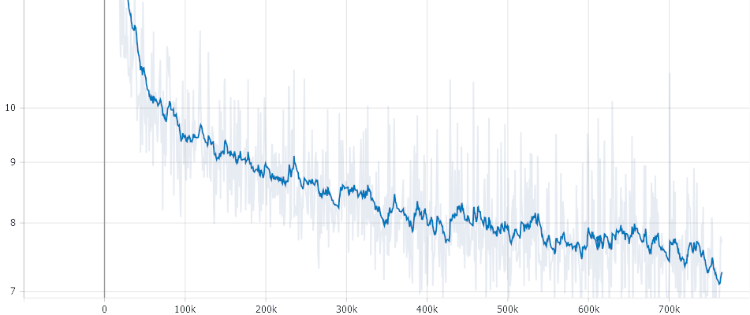

# electra-base-german-uncased
<a href="https://huggingface.co/exbert/?model=bert-base-german-cased">
	
</a>

## How to use
**The usage description above - provided by Hugging Face - is wrong! Please use this:**

### Transformers Usage
```python
from transformers import AutoTokenizer, AutoModelWithLMHead

tokenizer = AutoTokenizer.from_pretrained("model_name", strip_accents=False)
model = AutoModelWithLMHead.from_pretrained("model_name")
```

### FARM Usage
```python
# TODO
```

## Case and Umlauts ('Ö', 'Ä', 'Ü')
This model is uncased. We are convinced that capitalization does not add semantic value in German language.
Quite the opposite is the case. Many words are written in lower case but in upper case at the beginning of 
the sentence. The model would have to learn that these are the same words.

However, the German umlauts do make a semantic difference. Therefore this model does not do without umlauts.
The necessary parameter is `strip_accents=False` and needs to be set for the tokenizer.
It was added to Transformers with [PR #6280](https://github.com/huggingface/transformers/pull/6280).

Since Transformers has not been released since the PR #6280 was merged, you have to install the development
branch: 

`pip install git+https://github.com/huggingface/transformers.git -U`

## Creators
This model was trained and open sourced in conjunction with the **German NLP Group** in equal parts by:
- [Philip May](https://eniak.de) - [T-Systems on site services GmbH](https://www.t-systems-onsite.de/)
- [Philipp Reißel](https://www.reissel.eu) - [ambeRoad](https://amberoad.de/)

## Performance on downstream tasks

| Model Name                          | GermEval18 Coarse<br/>Median of 15 runs</br>F1 macro (1) |
|-------------------------------------|---------------------------------------------------|
| electra-base-german-uncased         | 0.0                                               |
| bert-base-german-cased              | 0.0                                               |
| dbmdz/bert-base-german-cased        | 0.0                                               |
| dbmdz/bert-base-german-uncased      | 0.0                                               |
| distilbert-base-german-cased        | 0.0                                               |


- (1): Hyperparameters taken from the [FARM project](https://farm.deepset.ai/) "[germEval18Coarse_config.json](https://github.com/deepset-ai/FARM/blob/master/experiments/german-bert2.0-eval/germEval18Coarse_config.json)"

## Pre-training details

### Data 
- Cleaned Common Crawl Corpus 2019-09 German: [CC_net Github](https://github.com/facebookresearch/cc_net) (Only head coprus and filtered for language_score > 0.98)
- German Wikipedia Article Pages Dump (20200701)
- German Wikipedia Talk Pages Dump (20200620)
- OpenSubtitles
- News 2018

Everything was split in sentences through with [SojaMo](https://github.com/tsproisl/SoMaJo)  
We took the Wikipedia Dump 3x to oversample it as it has a better quality than Common Crawl Data. This results in the following Distribution of our Data: 


Dataset                                                                  | Raw Size                                                               | Quality/Filtered                                         | URL | Oversampling Factor | Total Size = 29 GB gzip
---------------------------------------------------------------------------- | ---------------------------------------------------------------- | -------------------------------------------------------- | ----------------------------------------------- | ---------------------------------- | --------------- |
German Wikipedia Dump + Comments                                        |  5.4 GB   |      ++       |   [Download](http://ftp.acc.umu.se/mirror/wikimedia.org/dumps/dewiki/)    |  3 | 10 | 54 GB = 30 
FB cc_net (Common Crawl 2019-09 )                                       |  Head 75 GB |  +        |  <a href ='https://github.com/facebookresearch/cc_net'>Code</a>     |  1  |  1 | 75 GB : 42 %
Open Subtitles                                            | 1.3 GB  |    o    |  | ???  | 2  |  2.6 GB : 1.5 % 

More Details can be found here [Preperaing Datasets for German Electra Github](https://github.com/PhilipMay/german-transformer-training)

Due to the `strip_accent` command you have to clone this repo [Electra no_strip_accents](https://github.com/PhilipMay/electra/tree/no_strip_accents) and change to branch `no_strip_accents`. Then run the command for building the tf dataset: 

`python .......`

The resulting TF Dataset is about xx GB in size. 

## The training

The training itself can be performed with the Original Electra Repo (No special case for this needed). 
We run it with the following Config: 

### The exact Training Config
```
debug False
disallow_correct False
disc_weight 50.0
do_eval False
do_lower_case True
do_train True
electra_objective True
embedding_size 768
eval_batch_size 128
gcp_project None
gen_weight 1.0
generator_hidden_size 0.33333
generator_layers 1.0
iterations_per_loop 200
keep_checkpoint_max 0
learning_rate 0.0002
lr_decay_power 1.0
mask_prob 0.15
max_predictions_per_seq 79
max_seq_length 512
model_dir gs://XXX
model_hparam_overrides {}
model_name 02_Electra_Checkpoints_32k_766k_Combined
model_size base
num_eval_steps 100
num_tpu_cores 8
num_train_steps 766000
num_warmup_steps 10000
pretrain_tfrecords gs://XXX
results_pkl gs://XXXu
results_txt gs://XXX
save_checkpoints_steps 5000
temperature 1.0
tpu_job_name None
tpu_name electrav5
tpu_zone None
train_batch_size 256
uniform_generator False
untied_generator True
untied_generator_embeddings False
use_tpu True
vocab_file gs://XXX
vocab_size 32767
weight_decay_rate 0.01
```



Please Note: *Due to the GAN like strucutre of Electra the loss is not that meaningful* 

It took about 7 Days on a preemtible TPU V3-8. For an automatically recreation of a cancelled TPUs we used [tpunicorn](https://github.com/shawwn/tpunicorn). The total cost of training summed up to about 450 $ for one run. The Data-pre processing and Vocab Creation needed approximately 500-1000 CPU hours. Servers were fully provided by [T-Systems on site services GmbH](https://www.t-systems-onsite.de/), [ambeRoad](https://amberoad.de/) and Google through the [Tensorflow Research Cloud](https://www.tensorflow.org/tfrc). 
